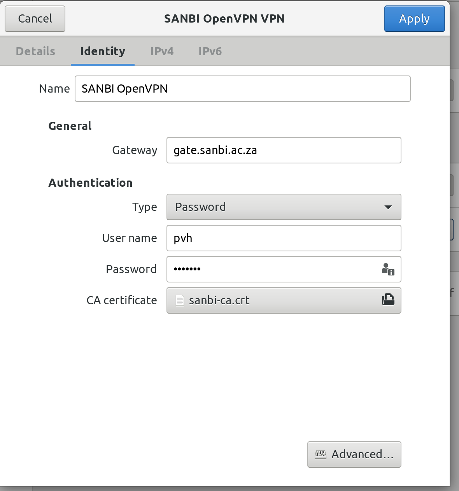
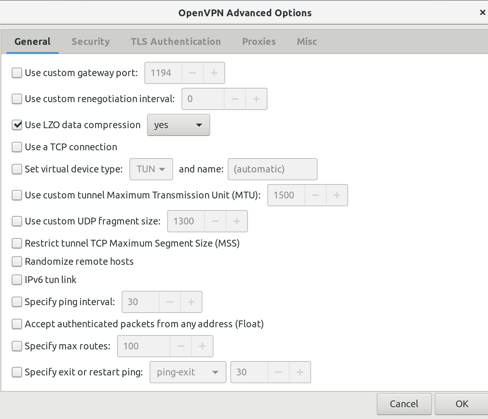
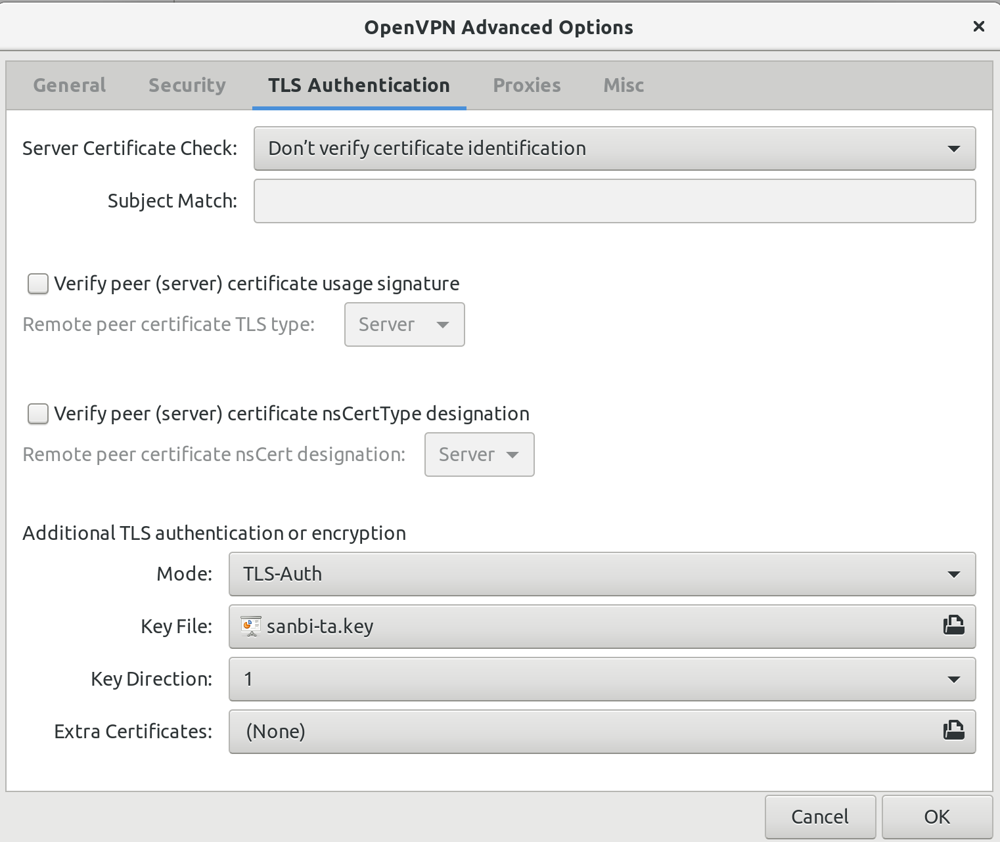
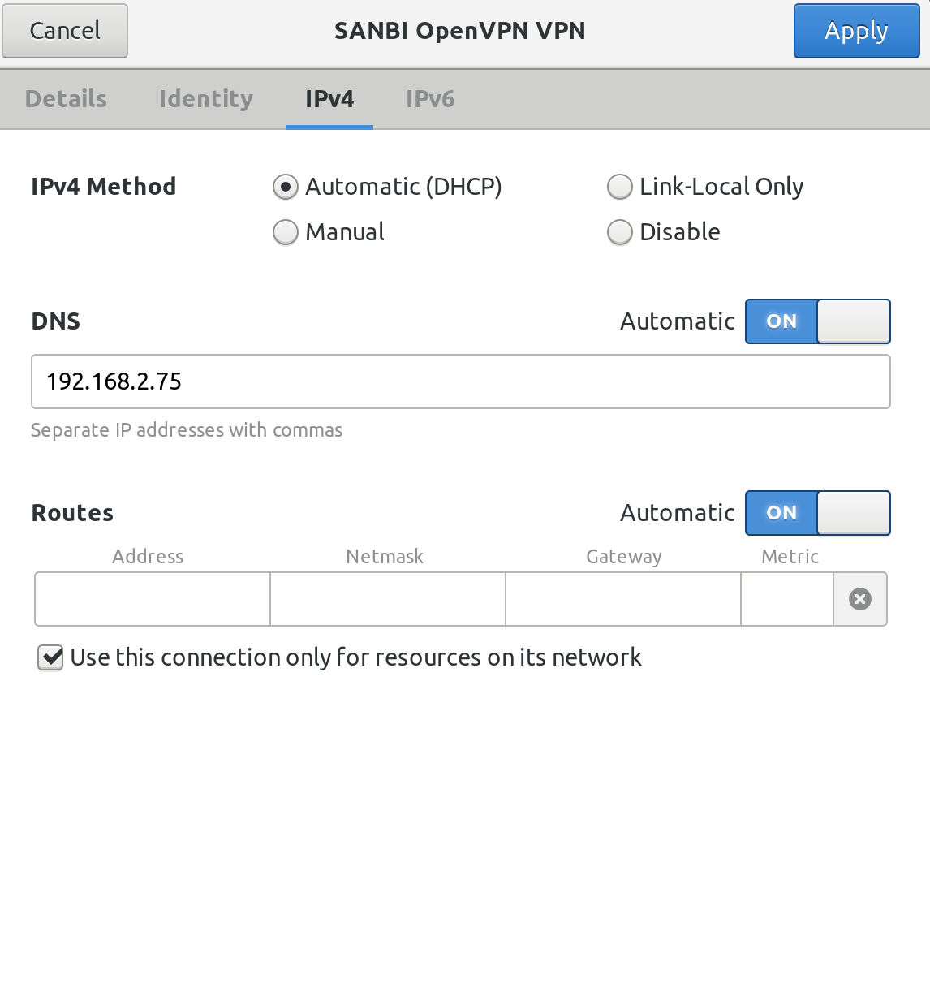

# Using the SANBI VPN

A user might want to access some SANBI internal network devices or services while being outside of SANBI. In this case, the user must use a VPN connection in order for the user's machine to act is if they are on the SANBI network.

SANBI hosts an OpenVPN server which users can conenct to in order to use the internal network outside of SANBI. The procedure for connecting to this server is different for each operating system. The sections below detail the way to do it for each major operating system:

## Ubuntu Linux

1. Install the `network-manager-openvpn-gnome` package using the Software Manager or `sudo apt install network-manager-openvpn-gnome` in a Terminal.
2. Fetch the files `sanbi-ca.crt` and `sanbi-ta.key` from `/cip0/software/openvpn` (accessible via `queue00.sanbi.ac.za`).
3. Navigate to `Settings` and then `Network` and add a VPN. You will see the following screen:

4. 
    1. Configure the VPN. First navigate to the *Identity* tab and choose an appropriate *Name*. Set the *Gateway* to `openvpn.sanbi.ac.za`, add your SANBI cluster (LDAP)
    username and password (in the *User name* and *Password* fields) and select the `sanbi-ca.crt` file for the *CA certificate* option. The settings screen will look
    like this:

    

    2. Configure *Advanced settings* by clicking the *Advanced* button on the *Identity* tab. Ensure that *Use LZO data compression* is set to *yes* on the *General* tab:

    

    3. Still in the *Advanced settings*, configure *TLS Authentication* and set *Advanced TLS authentication or encryption* to *Mode* *TLS-Auth*, choose `sanbi-ta.key`
    as the *Key File*, set *Key Direction* to **1** and leave *Extra Certificates* as *None*. Finally click *Ok* to accept the *Advanced* settings.

    

    4. Having completed the *Advanced* settings navigate to the *IPv4* tab. Ensure that *IPv4 Method* is set to *Automatic (DHCP)*, in the *DNS* settings *Automatic* is
    set to *On*, the *Routes* setting for *Automatic* is set to *On*. Finally ensure that *Use this connection only for resources on its network* is enabled and then
    click *Apply* to accept the OpenVPN settings.

    

5. You can now enable the VPN from the drop down in the status bar. Once you are connected you can connect to SANBI servers without going via `gate.sanbi.ac.za`.