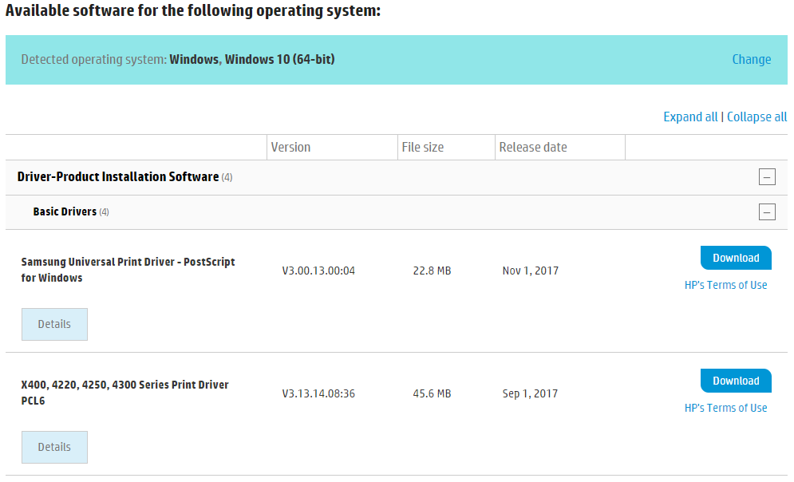
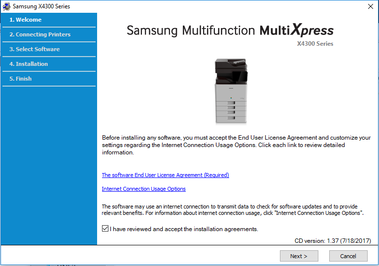
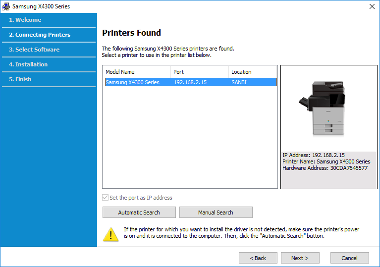

# Connecting to and using the SANBI printer

SANBI uses a Samsung X4300 series printer. In order to connect to it, you require some drivers for all operating systems.

## Ubuntu

You'll need to install the Samsung Unified Linux Driver (suldr) for Ubuntu.

```bash
sudo bash -c 'echo "deb http://www.bchemnet.com/suldr/ debian extra" >> /etc/apt/sources.list'
cd ~/Downloads  
wget http://www.bchemnet.com/suldr/pool/debian/extra/su/suldr-keyring_2_all.deb
sudo dpkg -i suldr-keyring_2_all.deb
sudo apt-get update
sudo apt-get install suld-driver-4.00.39
```

When done, you'll be able to add the printer via the normal way:

1. Open the Unity dash (Windows/Start key).
2. Type `printers` and open the printer configuration tool.
3. Click the `Add` button.
4. Select `Network Printer -> Find Network Printer` and type `printer.sanbi.ac.za` under `Host:`
5. Select `AppSocket/HP JetDirect` under the `Connections` and click `Forward`, `Forward` and `Apply`.

All done!

## Windows

Windows users need to download the latest drivers for the printer from the HP website.

Navigate to the official [HP Support Website](https://support.hp.com/za-en/drivers/selfservice/samsung-multixpress-sl-x4220-color-laser-multifunction-printer-series/16449682) for the printer in order to download the drivers.

Make sure that you have the correct Windows version for your laptop selected under **Detected operating system:** and select the `plus` icon next to **Driver-Product Installation Software** and **Basic Drivers** under that, if it is not already expanded. You should see something similar to the the following screen:

Select to download the **X400, 4220, 4250, 4300 Series Print Driver PCL6** driver by clicking the blue `Download` button.

Once the file is downloaded, you'll be greeted by the software installation wizard.

From here, click `Next`.

On the **Printer Selection Type** screen, click the radio button left of `Network` and click `Next`.

Select `No, my printer is already connected to my network.` on the next screen, followed by `Next`.

The printer should automatically be found and you should see the following:

Click `Next` after selecting the printer.

In the **Select Software to Install** screen, make sure that **_only_** the driver is selected, not the diagnostics software. Click `Next`.

The driver should now be installed and you should be able to print!

## MAC OS X

TBD